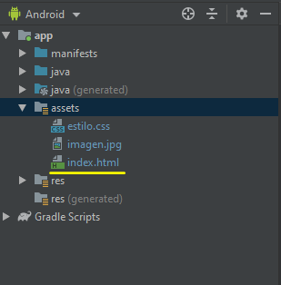
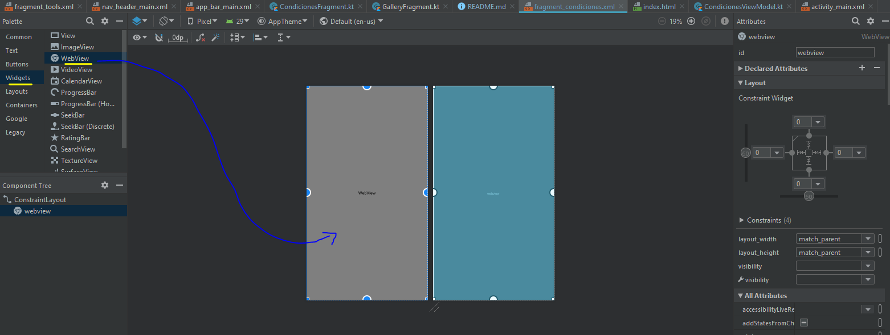
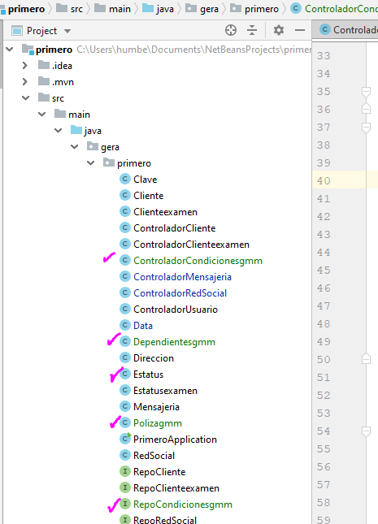

# Aplicación para un póliza de GMM 

1-.Creamos el navigation drawable

2-.Generamos la clase Póliza con los datos que contiene los datos de un asegurado.

3.,Generamos la clase Dependientes para los asegurados Titulares

4-.Generamos la clase Estatus para la corroboración de la información

5-.Generamos la interface PolizaService la cual no lleva método a diferencia de las clases que si llevan. En esta interfaz se van a crear los métodos GET, POST, DELETE, etc los cuales servirán para consultar la información de la póliza.

6-.Ahora vamos a generar la WebView en una de los layout de la aplicación, ésto lo haremos de la siguiente manera, primero creamos una carpeta dentro de la carpeta app/New/Folder/Asset Folder

7-.Dentro de esa carpeta generamos primero el archivo con terminación css, el cual nos ayudará a dar el formato que queramos a nuestra webview. Dentro de la carpeta assets New/File/ damos el nombre agregandole la terminación .css

8-.Ahora generamos el archivo index.html el cual tendra el código de nuestra webview, ahi colocaremos la información que nos aparecerá en nuestro layout.

8.1. Para que podamos acomodar el texto que irá en el webview de forma "justificada" así como color de letra, tabuladores, etc, declaramos las variables que ocuparemos en la parte de estilos,misma que se encuentra dentro de la carpeta ASSETS

9-.Una vez que generamos el Navigation , nos genera carpetas con cada uno de los layouts, el cual podemos renombrar para un mejor trabajo y programación.

10-.Dentro de cada una de las carpetas que se generan se crea en automático dos clases las cuales nos servirán para poder manipualr cada uno de los layouts, en este caso el primero será de las Condiciones generales en donde colocaremos en WebView.

11-.La primer clase que renombramos como CondicionesFragment es donde vamos a colocar el WebView, creamos el valor webview como se muestra:

12-.Colocamos la ruta donde va a buscar la webview, en este caso será en la carpeta assets que creamos previamente y en donde generamos el archivo index.html que es donde generamos la pagina que vamos a desplegar en el fragment_condiciones

13-. Para que en el layout fragment_condiciones aparezca la pagina web, primero debemos configurar éste layauot, lo que hacemos es que posicionandonos en el layaout fragment_condiciones , seleccionamos Widgets, luego la webview y lo arrastramos dentro del layout

14-.Una vez que lo arrastramos, configuramos la dimensión dejando en 0 cada uno de las cuatro paredes del layout. Renombramos el id como lo nombramos en la clase CondicionesFragment "webview".

# Creación del BACK END para generación de una base de datos y extraer la información de las pólizas.

1-.En el IntelliJIDEA creamos nuestras entidades para el mapeo de nuestros objetos que utilizaremos para homologar los que se craron en Android Studio.

 

2-.Generamos la clase Póliza

  

3-.Generamos la clase dependientes

 

4-.Generamos la clase Estatus

  

5-.Generamos la clase ControladorCondiciones el cual servirá para hacer las búsquedas de las pólizas, insertar etc

  

